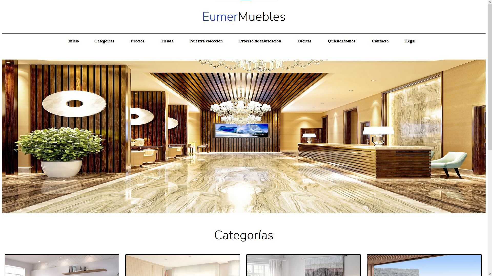
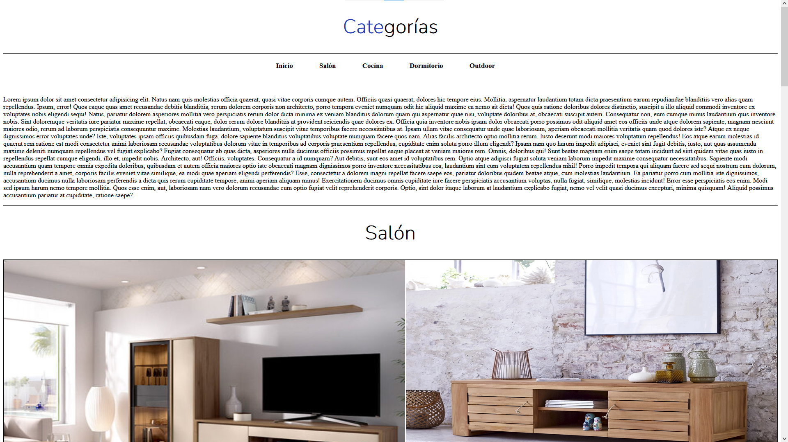
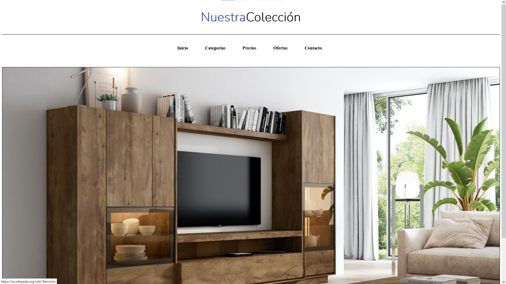
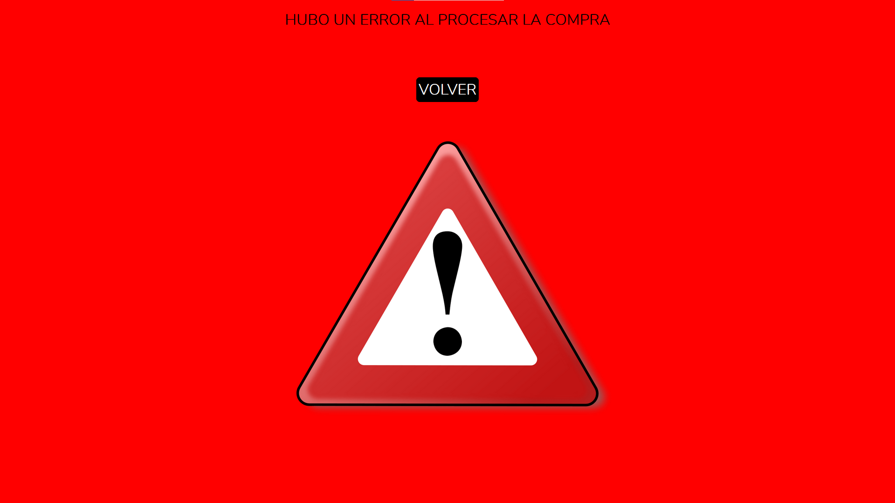
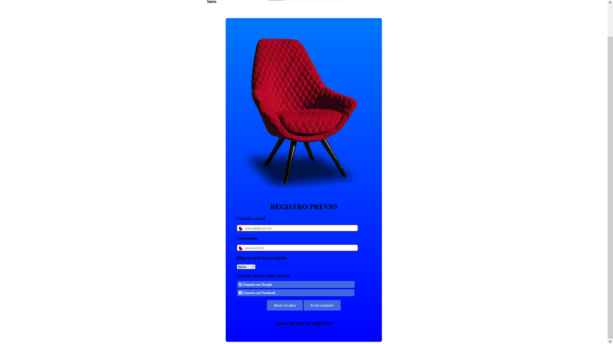
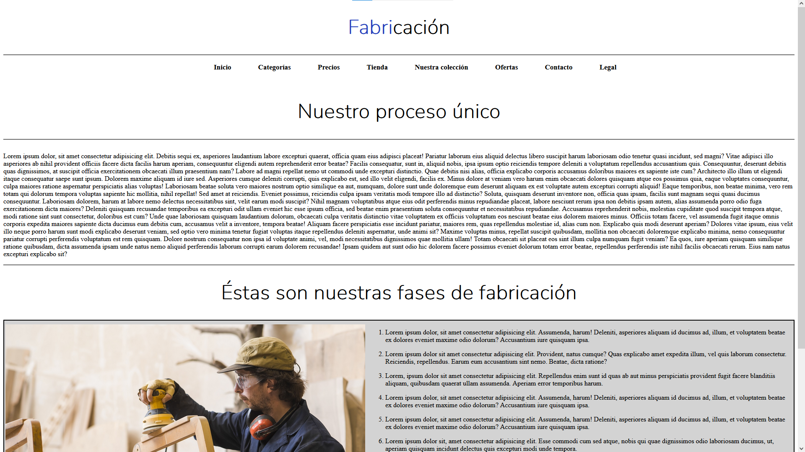
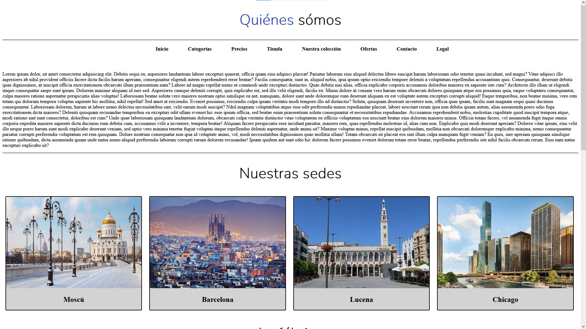
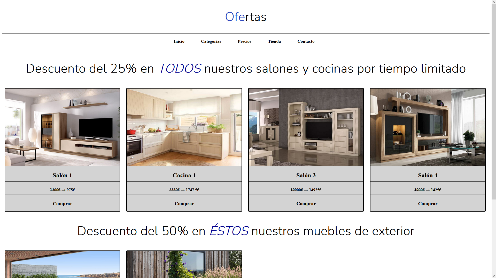
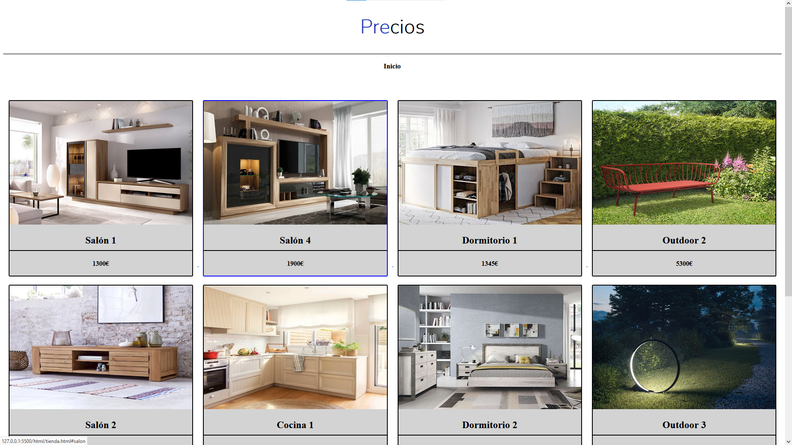

# Minimalistic web page template HTML5 CSS3

A minimalistic design for a furniture web, ready to use!.
Built using HTML5 and CSS3.
Simple and beautiful design. Main colors (white & blue).
Use it as template or as a little framework.

***Made as a college project. The language of files is Spanish***

Made with ❤ by eumermondio

## Table of contents

- [General View](#General-View)

    * [Pages](#Landing)
        + [Landing](#Landing)
        + [Categories](#Categories)
        + [Interactive Map (May not work as expected)](#Interactive-Map)
        + [Purchasing Page (not real)](#Purchasing-Page)
        + [Contact](#Contact)
        + [The Factory](#The-Factory)
        + [About Us](#About-Us)
        + [Bargains](#Bargains)
        + [Prices](#Prices)
        + [Shop](#Shop)

- [License](#License)

## General View

### Landing

### Categories

### Interactive Map

### Purchasing Page

### Contact

### The Factory

### About Us

### Bargains

### Prices

### Shop

## License

MIT